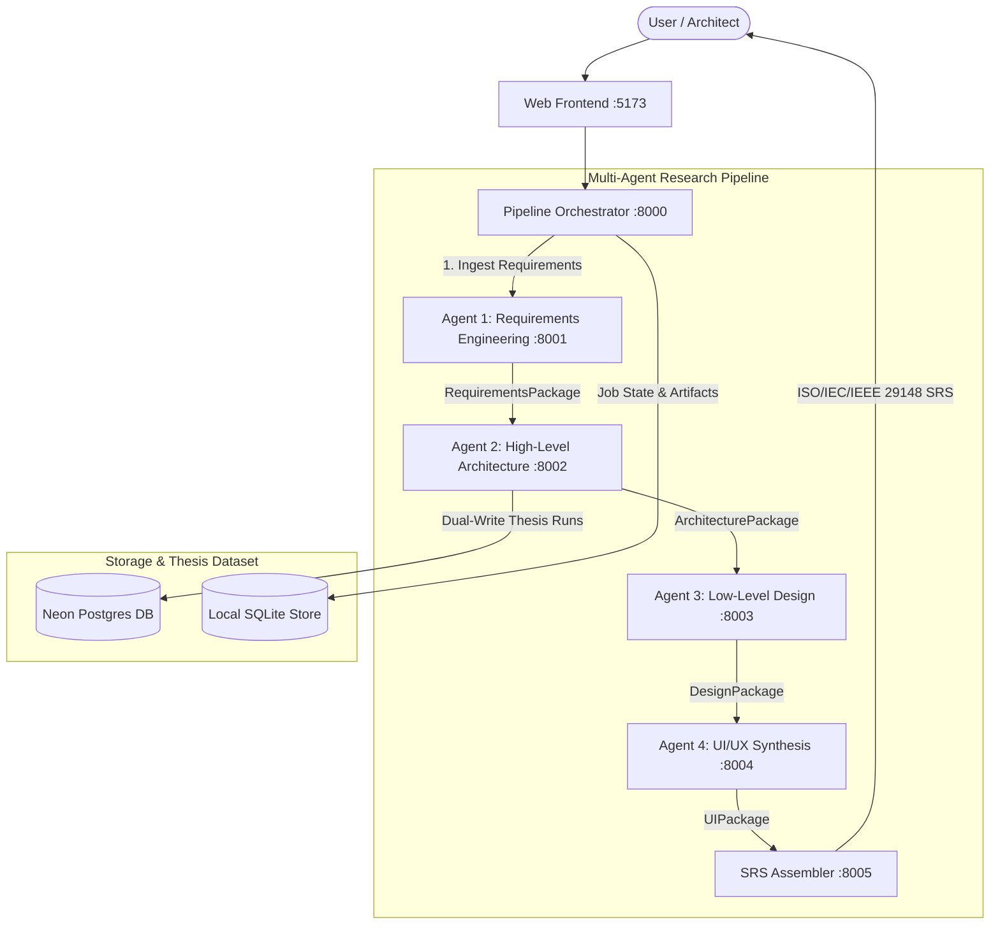

# 🌌 MMulti-Agent Software Architecture & Design Platform (R26-SE-017)

[](https://python.org)
[](https://fastapi.tiangolo.com)
[](https://react.dev)
[](https://vitejs.dev)
[](https://neon.tech)
[](LICENSE)

An enterprise-grade, multi-agent AI platform for automated software requirements analysis, high-level architecture generation, low-level design synthesis, and IEEE 29148-compliant specification generation.

---

## 🏛️ System Architecture

The platform operates as a coordinated 4-Agent pipeline orchestrated via an asynchronous event-driven workflow engine:



---

## 🤖 Agent Breakdown

| Service | Port | Description |
|---|---|---|
| **Pipeline Orchestrator** | `8000` | Coordinates stage transitions, state machines, and SSE real-time log streaming. |
| **Agent 1: Requirements** | `8001` | Ingests live meeting audio, SRS documents, extracts ISO/IEC 25010 functional & non-functional requirements. |
| **Agent 2: HLA Engine** | `8002` | Multi-LLM candidate generation, style classification, 6-metric ATAM evaluation, and diagram synthesis. |
| **Agent 3: LLD Engine** | `8003` | Class design, database schemas, and microservice interface generation. |
| **Agent 4: UI/UX Studio** | `8004` | Wireframe synthesis, component trees, and accessibility/usability heuristic evaluation. |
| **SRS Assembler** | `8005` | Compiles full IEEE 29148 Software Requirements Specification documents. |
| **Web Frontend** | `5173` | React 19 / Orbitron dark-mode interactive design studio and visual canvas. |

---

## 🔬 Agent 2: ATAM 6-Metric Evaluation Framework

Agent 2 implements a formal high-level architecture evaluation engine based on the **Architecture Tradeoff Analysis Method (ATAM)** and Analytic Hierarchy Process (AHP):

$$\text{CAS} = w_{\text{RTS}}\cdot\text{RTS} + w_{\text{QAC}}\cdot\text{QAC} + w_{\text{CI}}\cdot\text{CI} + w_{\text{CoS}}\cdot\text{CoS} + w_{\text{SSM}_1}\cdot\text{SSM}_1 + w_{\text{SSM}_2}\cdot\text{SSM}_2$$

### Metric Dimensions:
1. **RTS (Requirements Traceability Score)**: Semantic vector alignment between requirements and architecture components via `all-MiniLM-L6-v2`.
2. **QAC (Quality Attribute Coverage)**: Structural verification of ISO 25010 architectural provisions (Performance, Reliability, Security).
3. **CI (Coupling Index)**: Graph density and structural decoupling calculated via `NetworkX`.
4. **CoS (Cohesion Score)**: Semantic coherence of component responsibility statements.
5. **$\text{SSM}_1$ & $\text{SSM}_2$ (Style-Specific Metrics)**: Dynamically adapted structural metrics per architectural style:
   - **Layered**: Layer Isolation Score ($\text{LIS}$) & Directional Dependency Score ($\text{DDS}$)
   - **Microservices**: Service Boundary Autonomy ($\text{SBA}$) & Interface Segregation Score ($\text{ISS}$)
   - **Event-Driven**: Event Fanout Coverage ($\text{EFC}$) & Pub-Sub Decoupling ($\text{PSC}$)

---

## 🚀 Quick Start

### Prerequisites
- Python 3.11+
- Node.js 18+ and npm
- OpenRouter API Key

### 1. Installation

```bash
# Clone the repository
git clone https://github.com/Munasinghe123/R26-SE-017.git
cd R26-SE-017/sysdesign

# Install backend Python dependencies
pip install -r requirements.txt

# Install frontend dependencies
npm install --prefix apps/web
```

### 2. Configure Environment

Create `.env` inside `services/agent2-hld/.env`:

```ini
OPENROUTER_API_KEY=your_openrouter_api_key_here
OPENROUTER_MODEL_1=meta-llama/llama-3.3-70b-instruct
OPENROUTER_MODEL_2=qwen/qwen-2.5-72b-instruct
OPENROUTER_MODEL_3=deepseek/deepseek-chat-v3-0324
TRANSFORMERS_OFFLINE=1
```

### 3. Launch All Services

Launch all 7 services simultaneously with a single PowerShell script:

```powershell
.\run.ps1 all
```

Open **`http://localhost:5173`** in your browser to access the platform.

To stop all services:
```powershell
.\run.ps1 stop
```

---

## 📊 Live Vector Diagram Studio & Exporters

The Web Studio provides a side-by-side visual workspace:
- **Live Vector Diagram Canvas**: Real-time high-resolution dark theme SVG rendering of full package topologies and communication lines.
- **Dual-Engine Toggle**: Switch between **PlantUML (Enterprise)** and **Mermaid (GitHub Native)**.
- **1-Click Model Exporter**: Direct copy-paste format ready for **StarUML**, **Visual Paradigm**, and **Enterprise Architect**.
- **GitHub README Exporter**: Native Markdown block format ready for repo `README.md` files.

---

## 👥 Contributors (Research Team R26-SE-017)
- **Agent 1**: Requirements Engineering & Meeting Ingestion
- **Agent 2**: High-Level Architecture Evaluation & Synthesis
- **Agent 3**: Low-Level Design & Database Synthesis
- **Agent 4**: UI/UX Heuristics & Usability Evaluation

---

## 📜 License
This project is licensed under the MIT License — see the [LICENSE](LICENSE) file for details.
